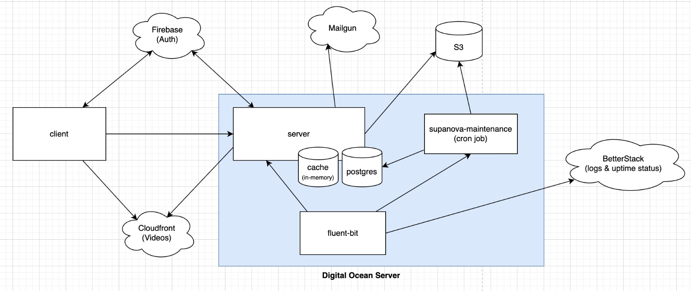

# Supanova Server

Go server for Supanova Radiation Protection Services learning platform using Echo for HTTP routing, PostgreSQL for data persistence, and sqlc for type-safe database queries.

### App architecture:


### API Structure
Refer to `CLAUDE.md` for a full overview of the repository structure, database access conventions, route registration patterns, etc. It's a configuration file that was generated by Claude Code, an AI-powered coding assistant.

### Development

#### Prerequisite files:
- `.env`
- `init.sql`

#### Setup:
```
make dep
```

If using VS Code, add this to your user settings to make sure it identifies build tags correctly:
```
"go.toolsEnvVars": {
    "GOFLAGS": "-tags=e2e"
}
```

#### Run with docker:
```
docker-compose up -d
```

#### Run without docker:
```
docker-compose up -d postgres # run only postgres via docker
make run
```

#### Lint:
```
make lint
```

#### Tests:
- Ensure the following env vars are set if using docker with colima:
```
set:
export DOCKER_HOST=unix://${HOME}/.colima/default/docker.sock
export TESTCONTAINERS_RYUK_DISABLED=true
```
Then run:
```
make test
```

- Running unit tests only:
`make test/unit`

- Running e2e tests only:
`make test/e2e`

#### Generate db queries:
```
make sqlc
```

#### Create a db migration:
```
make migrate/create name=<migration_name>
```

#### Generate mocks:
```
make mocks
```

#### Get Firebase access token (for testing):
Get an ID token for API authentication:
```bash
go run cmd/access_token/main.go -api-key=<firebase_web_api_key> -email=<email> -password=<password>
```

Get verbose output (includes user ID, expiration, refresh token):
```bash
go run cmd/access_token/main.go -api-key=<firebase_web_api_key> -email=<email> -password=<password> -verbose
```

Use the token in a curl request:
```bash
TOKEN=$(go run cmd/access_token/main.go -api-key=AIza... -email=test@example.com -password=pass123)
curl -X POST http://localhost:3000/v2/course \
  -H "Content-Type: application/json" \
  -d "{\"access_token\": \"$TOKEN\", \"courseId\": \"course-123\"}"
```

**Note:** The Firebase Web API Key can be found in Firebase Console → Project Settings → Web API Key
